# 💬 ConvoFusion

A **real-time chat application** built with the **MERN stack** (MongoDB, Express, React, Node.js) that integrates **AI chatbots**, **music streaming (Spotify)**, and **image generation (DALL·E)** for a rich and interactive communication experience.

---

## 🚀 Features

- 🔐 **Authentication:** Login, Register, Password Reset, Google Sign-In  
- 💭 **Chats:** One-to-one and group messaging with media sharing  
- 📞 **Calls:** Real-time audio and video calling using WebRTC  
- 🧑‍💻 **Screen Sharing:** Collaborate or present with shared screens  
- 🤖 **AI Chatbot:** Powered by OpenAI (ChatGPT)  
- 🎵 **Music Integration:** Spotify API for music sharing and discovery  
- 🖼 **Image Generation:** DALL·E API for AI-generated images  
- 🔔 **Notifications:** Real-time updates for messages and calls  

---

## 🧱 Tech Stack

| Layer | Technologies |
|-------|---------------|
| **Frontend** | React v18, Redux, Material-UI v5 |
| **Backend** | Node.js, Express.js, Socket.io |
| **Database** | MongoDB + Mongoose |
| **APIs/Services** | OpenAI (ChatGPT), DALL·E, Spotify, ZEGOCLOUD WebRTC |
| **Deployment** | AWS EC2, S3 |

---

## ⚙️ Setup Instructions

1. **Clone the repository**
   ```bash
   git clone https://github.com/yourusername/convofusion.git
   cd convofusion
   ```

2. **Install dependencies**
   ```bash
   npm install
   cd client && npm install
   ```

3. **Set up environment variables**  
   Create a `.env` file in the backend directory and include:
   ```
   MONGO_URI=your_mongodb_connection_string
   OPENAI_API_KEY=your_openai_key
   SPOTIFY_CLIENT_ID=your_spotify_id
   SPOTIFY_CLIENT_SECRET=your_spotify_secret
   ZEGOCLOUD_APP_ID=your_zegocloud_app_id
   ZEGOCLOUD_SERVER_SECRET=your_zegocloud_secret
   ```

4. **Run the project**
   ```bash
   # Start backend
   npm run server

   # Start frontend
   cd client
   npm start
   ```

---

## 🖼 Screenshots

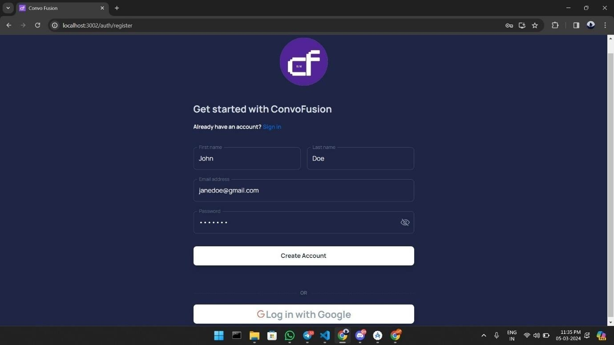  
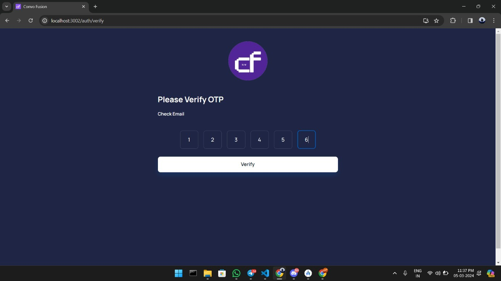  
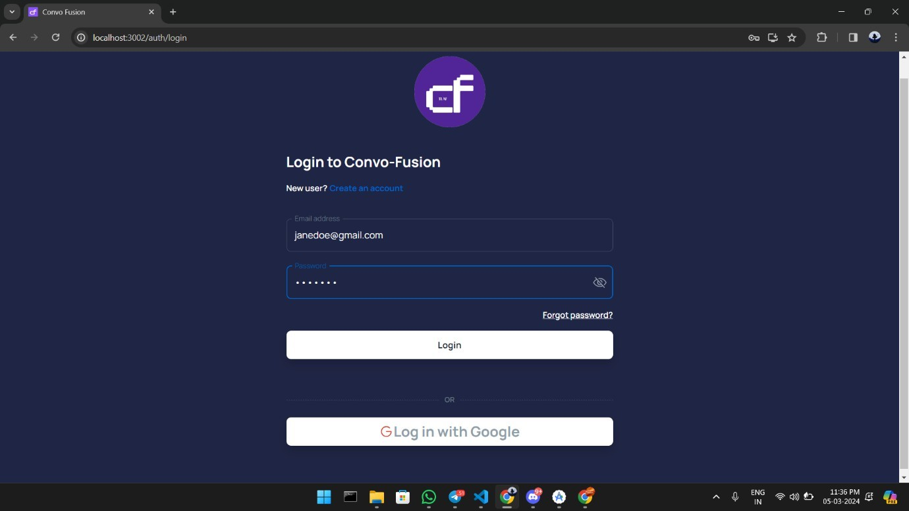  
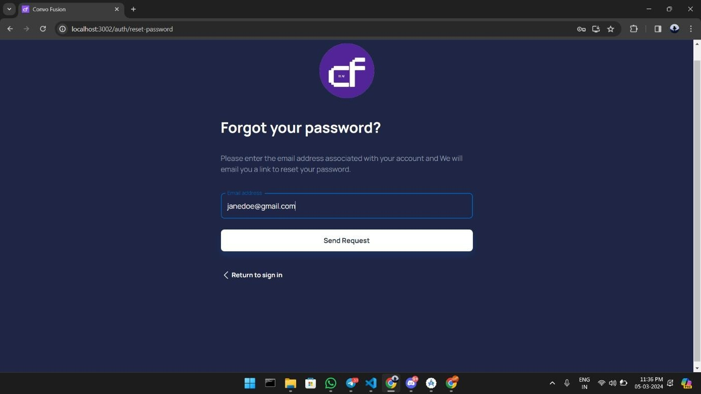  
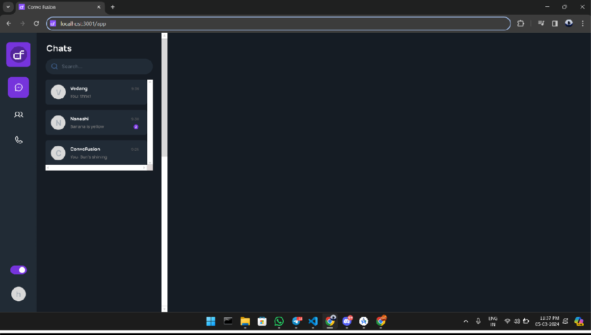  
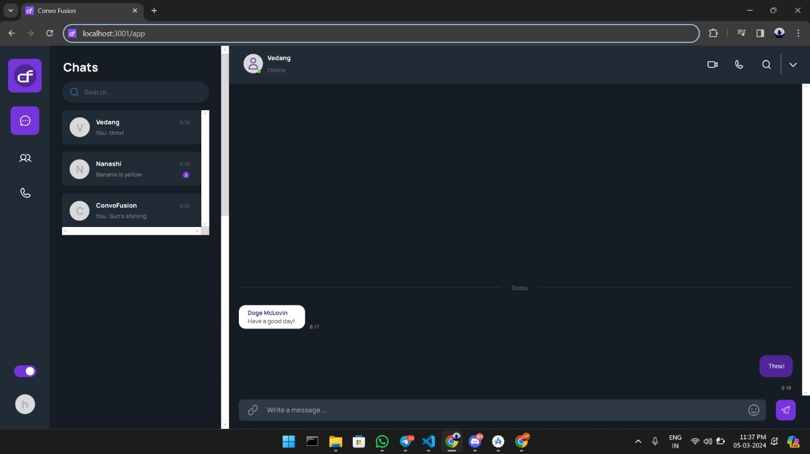  
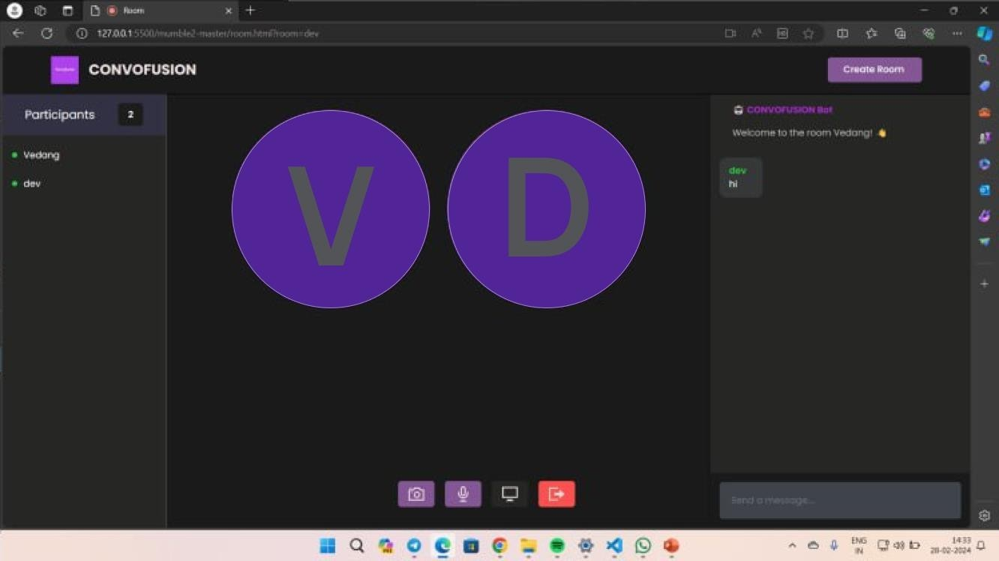  
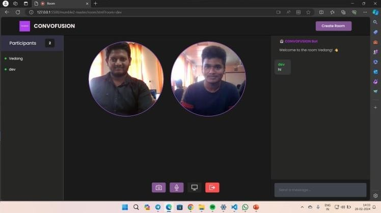  
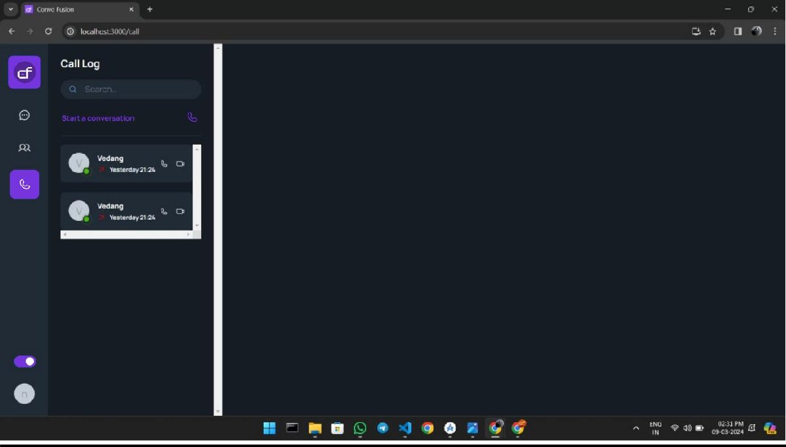  
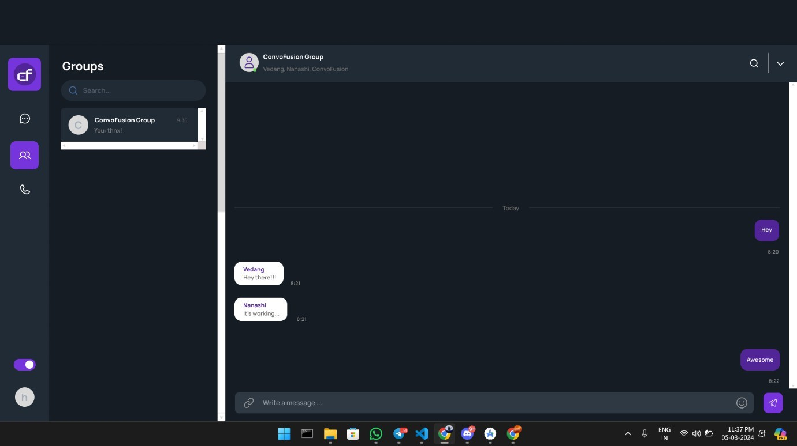  
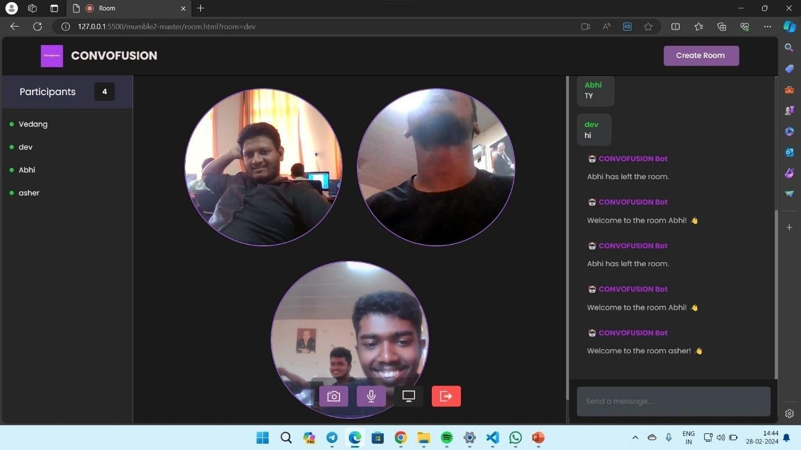  
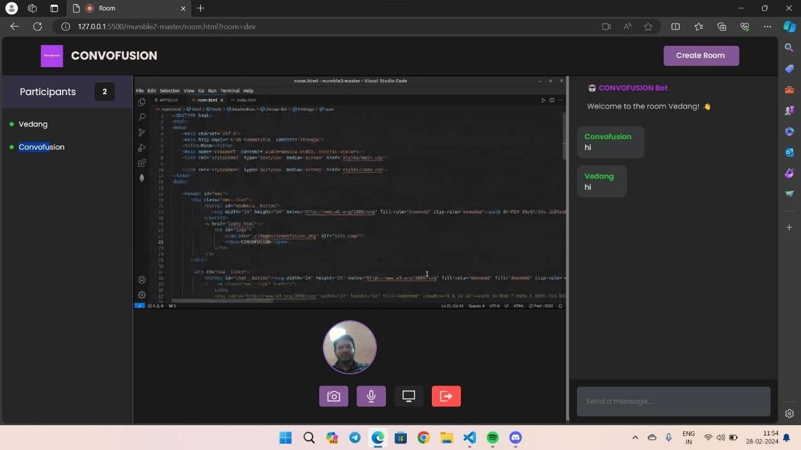

---

## 📘 Project Overview

ConvoFusion is designed to merge the power of **real-time communication** with **AI-driven interactions** and **music integration**.  
The app redefines traditional messaging by allowing users to **chat, stream, create, and connect—all in one place.**

---

## 👨‍💻 Team

- **Sihan Shaikh**  
- **Shreyash Devali**  
- **Devarsh Naik**  
- **Abhishek Johnson**  
- **Asher Pereira**  
- **Vedang Parab**  

Guided by **Mrs. Jyoti Kankonkar**, Assistant Professor, Computer Science  
**Government College of Arts, Science & Commerce, Quepem – Goa**

---

## 📜 License

MIT License © 2025 ConvoFusion Team
